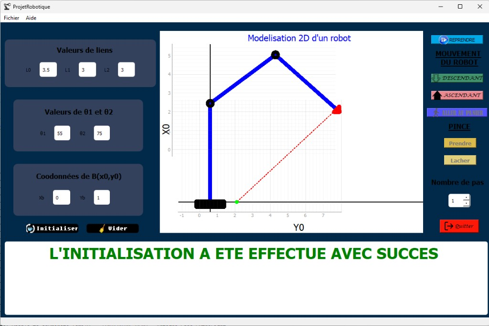

# Simulateur robot 2D

Application de bureau **PyQt5** qui modélise un robot plan à deux liaisons (plus un pied `L0`) et une pince. On saisit les longueurs, les angles et un point cible `B`, puis on visualise la cinématique, on interpolle le mouvement vers la cible, et on simule une saisie / un dépôt dans un panier.

Projet d’origine : 2021 (`ProjetRobotique`).



## Fonctionnalités

- Tracé 2D du bras, des articulations, de la pince et de la cible
- Vérification de saisie et de **configuration accessible** (le point `B` doit être atteignable)
- Interpolation en ligne droite vers `B` (boutons **DESCENDANT** / **ASCENDANT**) avec un nombre de pas réglable
- Inverse géométrique : affichage de `θ1` et `θ2` à chaque position
- Séquence **Prendre** → **Aller au panier** → **Lâcher**
- Réinitialisation de la pose (**REPRENDRE**) et vidage des champs

## Prérequis

- **Python 3** (3.10 ou plus récent, testé avec 3.13)
- **pip** (fourni avec Python)

Vérifier l’installation :

```bash
python --version
python -m pip --version
```

Sous Windows, si `python` n’est pas reconnu, utiliser `py` à la place.

## Installer les dépendances

À la racine du projet :

```bash
python -m pip install PyQt5 pyqtgraph numpy
```

Paquets installés :

| Paquet       | Rôle                                      |
| ------------ | ----------------------------------------- |
| `PyQt5`      | Fenêtre, boutons, champs de saisie        |
| `pyqtgraph`  | Tracé 2D du robot                         |
| `numpy`      | Matrices de passage et calculs            |

Environnement virtuel (recommandé) :

```bash
python -m venv .venv
```

Windows (PowerShell) :

```powershell
.\.venv\Scripts\Activate.ps1
python -m pip install PyQt5 pyqtgraph numpy
```

Linux / macOS :

```bash
source .venv/bin/activate
python -m pip install PyQt5 pyqtgraph numpy
```

## Lancer l’application

À la racine du dépôt :

```bash
python cliquez-ici.py
```

Sous Windows, `py cliquez-ici.py` convient aussi.

## Utilisation

1. Renseigner (ou conserver les valeurs par défaut) :
   - **L0, L1, L2** : longueurs des segments
   - **θ1, θ2** : angles initiaux (degrés)
   - **Xb, Yb** : coordonnées de la cible `B`
   - **Nombre de pas** : discrétisation du trajet vers `B`
2. Cliquer sur **Initialiser**. En cas d’erreur de type ou de configuration impossible, les champs passent en rouge et un message s’affiche en bas.
3. **DESCENDANT** avance la pince vers `B` ; **ASCENDANT** recule.
4. Arrivé sur `B`, **Prendre** saisit la boule et affiche le panier.
5. **ALLER AU PANIER** déplace la pince vers le panier ; **Lacher** relâche la boule.
6. **REPRENDRE** revient à la pose initiale ; **Vider** efface les champs ; **Quitter** ferme l’application.

Les menus **Fichier** et **Aide** sont présents mais sans actions.

## Structure du dépôt

```text
.
├── cliquez-ici.py       # Point d’entrée, interface et logique
├── assets/              # Icônes de l’interface (.ico) et capture README
├── Package/
│   └── fonctions.py     # Matrices de passage et changement de repère
└── README.md
```

- `cliquez-ici.py` a été généré à partir d’un fichier Qt Designer `robotique.ui` (`pyuic5`), puis enrichi de la logique métier.
- Les icônes sont chargées depuis `assets/` (chemins relatifs au fichier Python, pas au répertoire courant).

## Modèle cinématique

Les transformations sont des matrices homogènes 4×4 (rotation autour de Z + translation selon X), dans `Package/fonctions.py` :

- `Mat_Passage(i, f, theta, L)` : passage du repère `i` au repère `f`
- `Cord_otherR(point, mat)` : coordonnées d’un point dans un autre repère

Le graphe trace `(Y, X)` pour coller au modèle du robot : l’axe vertical du graphique correspond à `X0`, l’axe horizontal à `Y0`.

## Licence

Usage pédagogique. Aucune licence n’est déclarée dans le dépôt.
